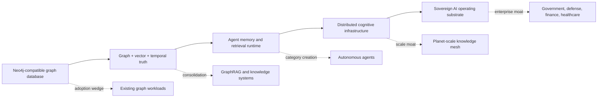
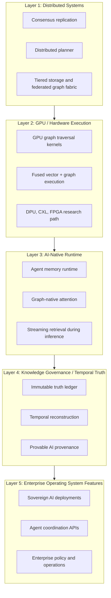
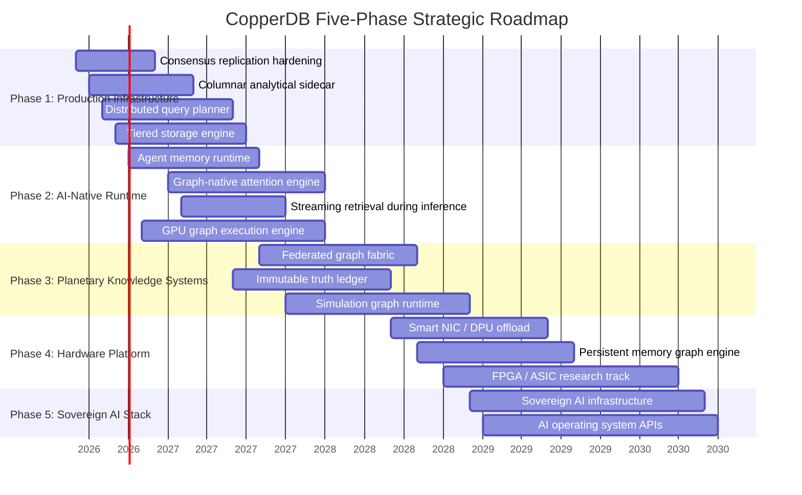
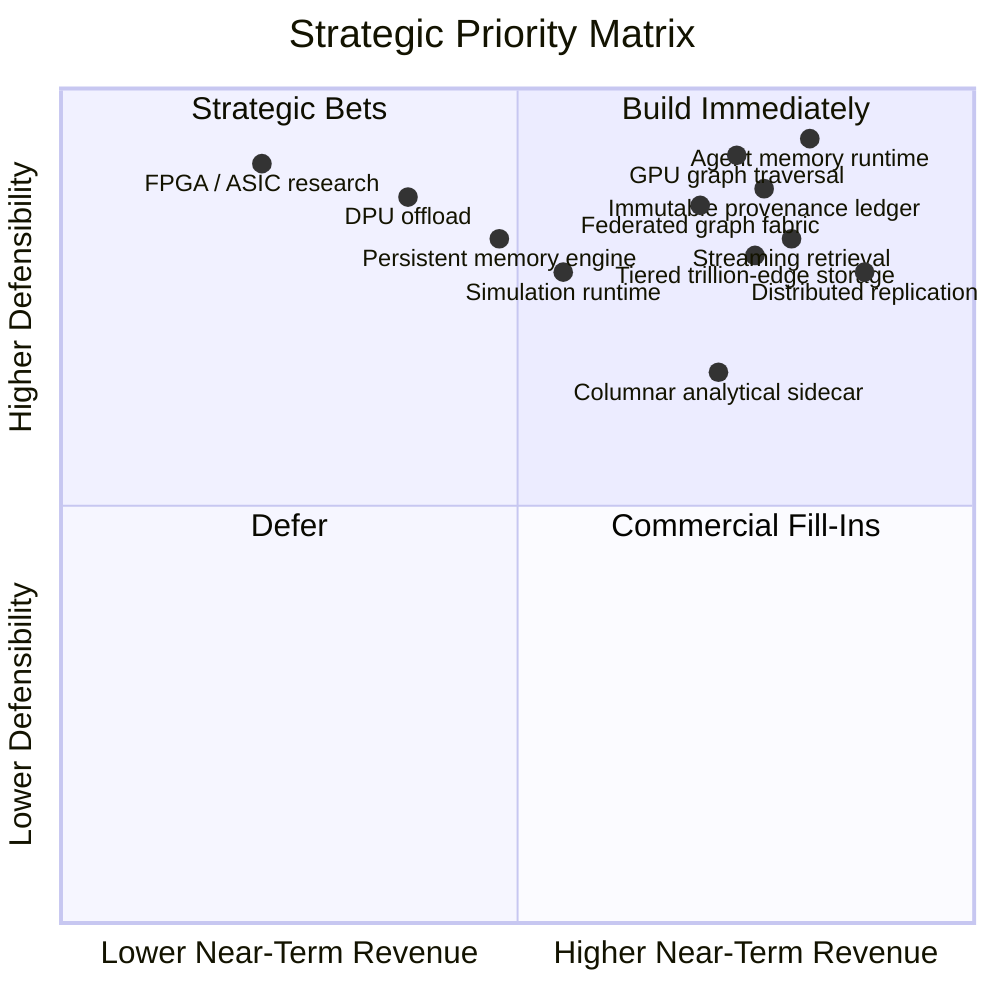
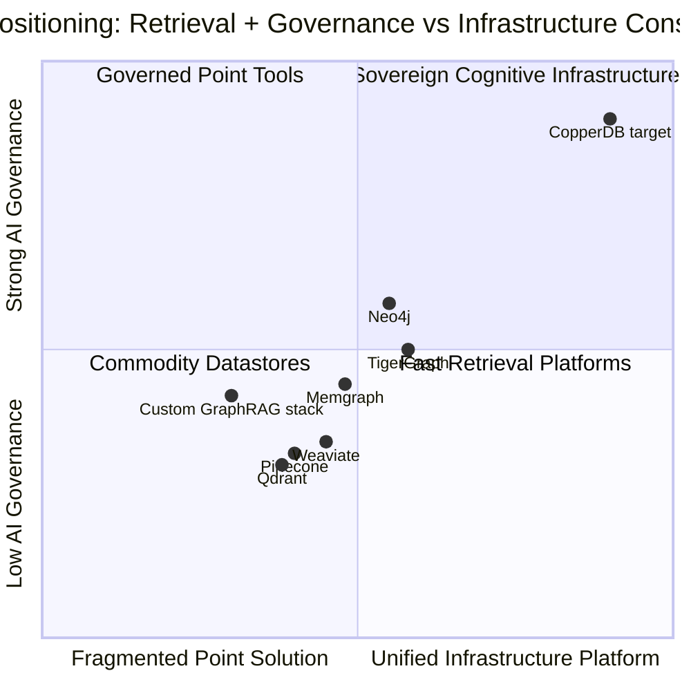
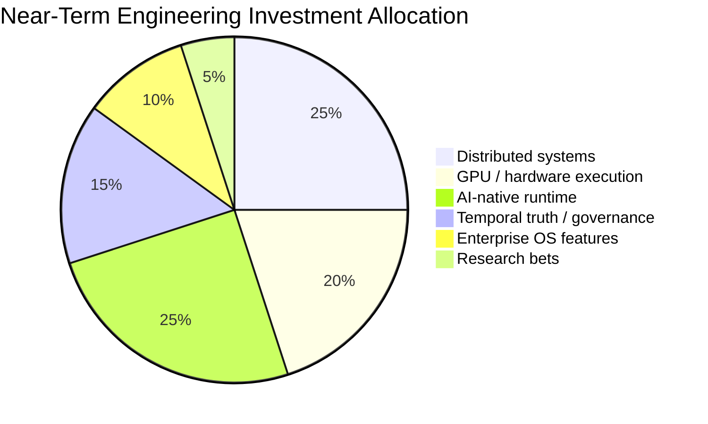

# CopperDB Strategic Product Roadmap

> This is a long-range product vision, not the implementation queue. Current status and engineering priority are governed by [COPPERDB_NORNICDB_PARITY_PLAN.md](COPPERDB_NORNICDB_PARITY_PLAN.md); distributed and GPU phases remain deferred until its single-node completion gate passes.

**Investor Demonstration Draft**  
**Date:** May 26, 2026  
**Positioning:** Single-node graph and retrieval engine first; broader distributed cognitive infrastructure later.

**Current execution guarantee:** copperDB should be documented and presented as a single-node execution architecture today. Any clustering, replication, federation, mesh, or cross-node planner material in this roadmap is forward-looking only and intentionally deferred until after the single-node engine/runtime is complete and stable.

---

## Evidence Standard

This roadmap separates claims into three evidence classes so the investor story can be cited cleanly:

| Evidence Class | Meaning | How To Read It |
| --- | --- | --- |
| **Current product evidence** | Capability or benchmark is documented in the existing NornicDB repository. | Cite the linked repository documentation directly. |
| **External technical precedent** | The feature direction is supported by public systems, standards, papers, or hardware documentation. | Cite the linked external source as proof that the architectural category is real. |
| **Roadmap target** | A proposed CopperDB build item, metric target, or package. | Treat as forward-looking; cite product evidence plus external precedent, not as a shipped capability. |

Forward-looking metrics such as sub-10ms streaming retrieval, order-of-magnitude GPU traversal speedups, trillion-edge operation, and sovereign AI packaging are product targets. They are intentionally framed as demonstration goals, not current benchmark claims.

## 1. Executive Thesis

CopperDB should no longer be presented as only a faster Neo4j-compatible graph database. The stronger category is **cognitive infrastructure runtime**: one coherent substrate for graph traversal, vector retrieval, temporal truth, provenance, agent memory, and hardware-accelerated knowledge execution. The current-product basis for this statement is the NornicDB README's positioning around graph, vector, historical truth, GraphRAG, memory decay, canonical graph ledger modeling, and hardware-accelerated execution in [README.md](README.md).

The near-term moat is compatibility plus consolidation on one node: CopperDB can reduce the need to operate separate graph, vector, retrieval, and audit systems for GraphRAG-style workloads, as supported by the architecture comparison in [docs/architecture/graph-rag-nornicdb-comparison.md](docs/architecture/graph-rag-nornicdb-comparison.md) and the hybrid retrieval benchmark in [docs/performance/hybrid-query-benchmarks.md](docs/performance/hybrid-query-benchmarks.md). The longer-term moat includes distributed cognition, GPU-native graph execution, sovereign AI memory, immutable truth infrastructure, and ultra-low-latency retrieval while intelligent systems are reasoning in real time, but those remain future roadmap items rather than present commitments.

### Strategic Repositioning

| Old Frame | Transition Frame | Future Frame |
| --- | --- | --- |
| Faster Neo4j-compatible graph database | Single-node graph + vector + temporal truth database | Cognitive infrastructure runtime for intelligent systems |
| Single-node performance advantage | Consolidated AI data plane on one node | Planet-scale knowledge and memory substrate |
| Query execution | Retrieval and reasoning execution | Distributed cognition fabric |
| Database buyer | AI platform, sovereign infrastructure, and agent runtime buyer | Enterprise AI operating system buyer |

### Why Now

Enterprises are assembling AI systems from disconnected components: graph databases, vector stores, retrieval layers, orchestration frameworks, audit ledgers, policy systems, and model-serving infrastructure. That fragmentation creates latency, governance gaps, duplicate storage, operational complexity, and weak provenance.

CopperDB can become the unifying layer: a database-compatible system that also behaves like an AI-native memory, retrieval, truth, and reasoning runtime.

---

## 2. Current Foundation

CopperDB starts with a credible base rather than a speculative deck-only vision.

| Foundation | Current Strategic Value | Investor Meaning | Primary Citation |
| --- | --- | --- | --- |
| Neo4j compatibility | Low-friction migration path for existing graph workloads | Fast adoption wedge | [docs/neo4j-migration/feature-parity.md](docs/neo4j-migration/feature-parity.md) |
| Bolt, Cypher, REST, GraphQL, gRPC | Multiple protocol surfaces without splitting the data plane | Broad ecosystem reach | [README.md](README.md) |
| Graph + vector retrieval | Hybrid GraphRAG in one engine | Replaces graph DB + vector DB stacks | [docs/performance/hybrid-query-benchmarks.md](docs/performance/hybrid-query-benchmarks.md), [docs/architecture/graph-rag-nornicdb-comparison.md](docs/architecture/graph-rag-nornicdb-comparison.md) |
| Temporal / MVCC reads | Historical state and audit-friendly reads | Trustworthy AI memory and governance | [docs/user-guides/transactions.md](docs/user-guides/transactions.md), [docs/user-guides/historical-reads-mvcc-retention.md](docs/user-guides/historical-reads-mvcc-retention.md) |
| Knowledge-layer scoring | Decay, promotion, and retention semantics | Native agent memory foundation | [docs/features/memory-decay.md](docs/features/memory-decay.md), [docs/user-guides/promotion-policies.md](docs/user-guides/promotion-policies.md) |
| Auto-relationships | Automatic graph enrichment from semantic similarity | Cognitive graph growth loop | [README.md](README.md), [pkg/linkpredict/README.md](pkg/linkpredict/README.md) |
| GPU acceleration paths | Metal, CUDA, Vulkan-oriented execution surfaces | Hardware-native AI infrastructure direction | [docs/performance/test-results.md](docs/performance/test-results.md), [docs/packaging/docker.md](docs/packaging/docker.md), [pkg/simd/README.md](pkg/simd/README.md) |
| Clustering, replication, composite databases | Deferred roadmap surface only; not part of the current runtime guarantee | Longer-term scale-out path | [docs/architecture/clustering-roadmap.md](docs/architecture/clustering-roadmap.md), [docs/architecture/replication.md](docs/architecture/replication.md) |
| APOC and procedure compatibility | Familiar graph operations and algorithms | Migration and developer trust | [docs/neo4j-migration/feature-parity.md](docs/neo4j-migration/feature-parity.md), [apoc/README.md](apoc/README.md) |

### Core Narrative Shift

---

## 3. Five-Layer Roadmap Architecture

Before any Layer 1 distributed-systems work in this roadmap, the product requirement is to finish and stabilize the single-node architecture. Distributed layers remain explicitly sequenced after that point.

The roadmap is organized into five product layers. Each layer maps to a buyer pain, a technical moat, and a commercial story.

| Layer | Product Promise | Moat Created | Primary Buyer |
| --- | --- | --- | --- |
| Distributed Systems | Scale the graph across nodes, regions, and sovereign boundaries | Operational scale and data locality | Platform engineering, data infrastructure |
| GPU / Hardware Execution | Execute graph, vector, and analytical workloads on AI accelerators | Latency and throughput advantage | AI infrastructure, high-performance computing |
| AI-Native Runtime | Treat memory, retrieval, and reasoning context as first-class database operations | Agent memory category ownership | AI platform teams, agent builders |
| Knowledge Governance / Temporal Truth | Prove what the system knew, when it knew it, and why it acted | Trust, audit, compliance | Regulated enterprise, government |
| Enterprise Operating System Features | Expose the runtime as the substrate for intelligent applications | Platform lock-in through useful APIs | CIO, CTO, sovereign AI programs |

---

## 4. Product Phases

### Phase 1: Production Infrastructure Layer

**Goal:** Convert technical credibility into enterprise purchasing confidence.

**Target horizon:** 0-12 months

| Product Pillar | Capabilities | Business Outcome | Citation Basis |
| --- | --- | --- | --- |
| Consensus Replication Hardening | Raft groups, automatic leader election, write quorum, follower reads, lease reads, WAL streaming, snapshot shipping, multi-region replication | Moves CopperDB from engine to serious distributed datastore | Current replication docs: [docs/architecture/replication.md](docs/architecture/replication.md). Raft precedent: [Raft consensus site](https://raft.github.io/). Distributed datastore precedent: [CockroachDB architecture](https://www.cockroachlabs.com/docs/stable/architecture/overview), [FoundationDB overview](https://apple.github.io/foundationdb/). |
| Columnar Analytical Sidecar | Arrow-native execution, Parquet snapshots, vectorized aggregations, materialized graph projections, GPU analytical scans | Real-time graph analytics without ETL | Arrow columnar memory format: [Apache Arrow](https://arrow.apache.org/). Parquet columnar file format: [Apache Parquet](https://parquet.apache.org/). |
| Distributed Query Planner | Cost-based, locality-aware, vector-aware, GPU-aware, temporal-aware planning | Makes performance predictable at scale | Current sharding/federation surface: [docs/architecture/clustering-roadmap.md](docs/architecture/clustering-roadmap.md). CockroachDB locality/distribution precedent: [CockroachDB architecture](https://www.cockroachlabs.com/docs/stable/architecture/overview). |
| Tiered Storage Engine | RAM graph cache, NVMe compressed graph segments, object-store archives, immutable historical snapshots | Trillion-edge and long-retention deployments | Current memory/storage guidance: [docs/architecture/indexing-memory-large-datasets.md](docs/architecture/indexing-memory-large-datasets.md), [docs/operations/low-memory-mode.md](docs/operations/low-memory-mode.md), [docs/user-guides/historical-reads-mvcc-retention.md](docs/user-guides/historical-reads-mvcc-retention.md). |

**Investor proof points to show:**

| Metric | Demonstration Target |
| --- | --- |
| Cluster survivability | Leader failover without data loss in a 3-node deployment |
| Hybrid query scale | Cross-shard vector + graph retrieval with bounded latency |
| Analytical freshness | Graph projection query served from Arrow/Parquet sidecar within seconds of writes |
| Storage economics | Hot/warm/cold graph retention with materially lower cost per historical edge |

### Phase 2: AI-Native Cognitive Infrastructure

**Goal:** Own the agent memory and low-latency reasoning substrate category.

**Target horizon:** 6-24 months

| Product Pillar | Capabilities | Business Outcome | Citation Basis |
| --- | --- | --- | --- |
| Native Agent Memory Runtime | Episodic, semantic, and procedural memory; reinforcement weighting; confidence scoring; source provenance; contradiction graphs; hallucination decay; memory compression | Becomes the database for autonomous agents | Current decay/promotion base: [docs/features/memory-decay.md](docs/features/memory-decay.md), [docs/user-guides/knowledge-layer-policies.md](docs/user-guides/knowledge-layer-policies.md). Cognitive-memory framing: [Ebbinghaus-Roynard reference from README](https://arxiv.org/pdf/2604.11364). |
| Graph-Native Attention Engine | Semantic diffusion, weighted activation, graph attention walks, neural traversal scoring, multi-hop contextual expansion | Turns GraphRAG into inference-aware retrieval | GraphRAG precedent: [Microsoft GraphRAG](https://github.com/microsoft/graphrag). Graph attention research precedent: [Graph Attention Networks](https://arxiv.org/abs/1710.10903). |
| Native Token Streaming Retrieval | Incremental retrieval, speculative retrieval, retrieval continuation, semantic prefetch, streaming graph expansion | Sub-10ms retrieval while LLMs generate | Current low-latency hybrid-retrieval base: [docs/performance/hybrid-query-benchmarks.md](docs/performance/hybrid-query-benchmarks.md). Target remains forward-looking until demonstrated with token-streaming benchmarks. |
| GPU Graph Execution Engine | GPU BFS, shortest path, PageRank, ANN traversal, fused vector + graph kernels, warp-optimized adjacency traversal | Makes CopperDB the graph database designed for AI accelerators | Current GPU/vector base: [pkg/simd/README.md](pkg/simd/README.md), [docs/packaging/docker.md](docs/packaging/docker.md). GPU graph precedent: [RAPIDS cuGraph](https://docs.rapids.ai/api/cugraph/stable/), [cuGraph supported algorithms](https://docs.rapids.ai/api/cugraph/stable/graph_support/algorithms/). |

**Investor proof points to show:**

| Metric | Demonstration Target |
| --- | --- |
| Agent memory quality | Measurable improvement in task recall, conflict handling, and source-grounded answers |
| Retrieval latency | Sub-10ms local continuation retrieval during token generation |
| GPU graph speedup | Order-of-magnitude improvement for selected traversal and PageRank workloads |
| GraphRAG relevance | Better multi-hop answer quality than vector-only retrieval baselines |

### Phase 3: Planetary Scale Knowledge Systems

**Goal:** Expand from database cluster to federated knowledge fabric.

**Target horizon:** 18-36 months

| Product Pillar | Capabilities | Business Outcome | Citation Basis |
| --- | --- | --- | --- |
| Knowledge Mesh / Federated Graph Fabric | Remote graph references, federated Cypher, sovereign graph partitions, tenant isolation, edge virtualization, WAN-aware traversal planning | Kubernetes-like control plane for knowledge graphs | Current composite/remote constituent base: [docs/architecture/clustering-roadmap.md](docs/architecture/clustering-roadmap.md), [docs/user-guides/infinigraph-topology.md](docs/user-guides/infinigraph-topology.md). |
| Immutable Truth Ledger | Cryptographic receipts, Merkle graph verification, signed mutations, chain-of-truth proofs, forensic replay, provable AI provenance | Governance infrastructure for AI systems | Current canonical ledger and receipts base: [docs/user-guides/canonical-graph-ledger.md](docs/user-guides/canonical-graph-ledger.md). Future cryptographic extensions are roadmap targets. |
| Simulation Graph Runtime | Dynamic graph simulation, event propagation, temporal causality, probabilistic transitions, cyber-physical modeling, agent simulation runtime | Opens robotics, defense, industrial automation, and digital twin markets | Current graph algorithm and temporal base: [docs/neo4j-migration/feature-parity.md](docs/neo4j-migration/feature-parity.md), [docs/user-guides/canonical-graph-ledger.md](docs/user-guides/canonical-graph-ledger.md). Market/application targeting is forward-looking. |

**Investor proof points to show:**

| Metric | Demonstration Target |
| --- | --- |
| Federation | Query across sovereign partitions without centralizing data |
| Provenance | Verify a generated answer back to signed graph facts and time-bound evidence |
| Simulation | Run event propagation over a temporal graph with replayable causal state |

### Phase 4: Hardware + Infrastructure Platform

**Goal:** Build a deep-tech performance and prestige moat.

**Target horizon:** 24-48 months

| Product Pillar | Capabilities | Business Outcome | Citation Basis |
| --- | --- | --- | --- |
| Smart NIC / DPU Offload | Traversal filtering, vector distance ops, WAL replication, compression, packet filtering | Lower latency and CPU overhead for high-throughput clusters | DPU/offload precedent: [NVIDIA DOCA SDK](https://docs.nvidia.com/doca/sdk/index.html), including BlueField, compression, file integrity, GPU packet processing, crypto, TLS, and switching examples. |
| Persistent Memory Graph Engine | CXL memory pooling, memory-mapped graph segments, zero-copy traversal, persistent memory layouts | Ultra-low-latency graph deployments | CXL memory infrastructure precedent: [Compute Express Link Consortium](https://www.computeexpresslink.org/). Arrow zero-copy precedent: [Apache Arrow](https://arrow.apache.org/). |
| FPGA / ASIC Graph Traversal Research | ANN acceleration, temporal filtering hardware, graph traversal ASIC concepts, memory decay scoring hardware | Research leadership and long-term defensibility | Roadmap research target; cite GPU graph precedent first via [RAPIDS cuGraph](https://docs.rapids.ai/api/cugraph/stable/) and treat FPGA/ASIC as exploratory until partner/paper evidence exists. |

**Investor proof points to show:**

| Metric | Demonstration Target |
| --- | --- |
| DPU offload | Reduced CPU utilization for replication and filtering paths |
| Persistent memory | Microsecond-class traversal path for hot graph segments |
| Research credibility | Published benchmarks, partner prototypes, or academic collaboration |

### Phase 5: Enterprise Sovereign AI Stack

**Goal:** Become the operating substrate for regulated intelligent systems.

**Target horizon:** 30-60 months

| Product Pillar | Capabilities | Business Outcome | Citation Basis |
| --- | --- | --- | --- |
| Sovereign AI Knowledge Infrastructure | Air-gapped inference, sovereign graph memory, classified deployments, edge replication, offline sync, cryptographic provenance | Wins defense, government, healthcare, finance, and regulated enterprise programs | Current local/BYOM deployment and governance base: [README.md](README.md), [docs/packaging/docker.md](docs/packaging/docker.md), [docs/user-guides/canonical-graph-ledger.md](docs/user-guides/canonical-graph-ledger.md). Regulated-market packaging is forward-looking. |
| AI Operating System APIs | Memory APIs, reasoning APIs, temporal APIs, provenance APIs, agent coordination APIs, knowledge activation APIs | CopperDB becomes a runtime platform, not only a database | Current API/procedure base: [README.md](README.md), [docs/features/memory-decay.md](docs/features/memory-decay.md), [docs/user-guides/canonical-graph-ledger.md](docs/user-guides/canonical-graph-ledger.md). OS/API packaging is forward-looking. |

**Investor proof points to show:**

| Metric | Demonstration Target |
| --- | --- |
| Air-gapped deployment | Full GraphRAG and memory runtime without external services |
| Governance | Audit-safe AI workflow with provenance, temporal reconstruction, and signed mutation chain |
| Platform usage | Applications built directly on memory, reasoning, and provenance APIs |

---

## 5. Roadmap Timeline Chart

---

## 6. Priority Matrix

The first seven features produce the strongest combination of near-term commercial value and long-term moat.

### Highest-Leverage Build Order

| Rank | Capability | Why It Comes First |
| ---: | --- | --- |
| 1 | Distributed replication hardening | Required for enterprise trust and serious production adoption |
| 2 | GPU graph traversal | Converts hardware support into a hard performance moat |
| 3 | Agent memory runtime | Creates the strongest AI-native category narrative |
| 4 | Federated graph fabric | Extends the system from cluster to sovereign knowledge mesh |
| 5 | Immutable provenance ledger | Makes CopperDB relevant to AI governance and regulated markets |
| 6 | Streaming retrieval during inference | Directly improves real-time agent and copilot experiences |
| 7 | Tiered storage + trillion-edge scaling | Unlocks temporal history retention and massive knowledge systems |

---

## 7. Competitive Positioning Chart

### Competitive Claim

CopperDB should not compete as another graph database. It should compete against fragmented AI infrastructure stacks.

The competitor chart is directional positioning, not a benchmark. Its citable basis is category documentation: Neo4j publishes graph algorithms and graph database documentation, Qdrant documents vector search, hybrid retrieval, sharding, and replication in [Qdrant Overview](https://qdrant.tech/documentation/overview/), Weaviate describes itself as an open-source vector database in [Weaviate Database](https://docs.weaviate.io/weaviate), Pinecone describes itself as a vector database in [Pinecone documentation](https://docs.pinecone.io/), and Memgraph describes itself as an open-source graph database compatible with Neo4j in [Memgraph Documentation](https://memgraph.com/docs). The exact quadrant coordinates are analyst judgment for presentation, so they should be labeled as CopperDB's strategic view rather than third-party market data.

| Fragmentation Today | CopperDB Answer |
| --- | --- |
| Graph DB + vector DB + retrieval framework | Native graph + vector + retrieval execution |
| Separate memory framework for agents | Built-in episodic, semantic, and procedural memory |
| Separate audit ledger | Immutable temporal truth and provenance ledger |
| Separate analytics pipeline | Columnar sidecar and materialized graph projections |
| Separate federation layer | Knowledge mesh and sovereign graph partitions |
| Separate acceleration stack | GPU-native graph and vector execution |

---

## 8. Investor Demo Storyboard

### Demo Title

**CopperDB: One Cognitive Substrate for Intelligent Systems**

### Demo Arc

| Scene | What Investors See | Strategic Message |
| --- | --- | --- |
| 1. Compatibility Wedge | Existing Neo4j-style app runs against CopperDB | Adoption does not require a rip-and-replace rewrite |
| 2. Hybrid Retrieval | A semantic query retrieves vectors and expands graph context in one engine | CopperDB consolidates graph and vector stacks |
| 3. Temporal Truth | The same query is reconstructed as of a prior time | AI systems need memory with history, not just embeddings |
| 4. Agent Memory | An agent stores, promotes, decays, and resolves conflicting memories | CopperDB owns the agent memory layer |
| 5. Provenance | The answer is traced back to signed facts, sources, and mutation history | Governance becomes native to the data substrate |
| 6. Distributed Scale | Query spans multiple shards / regions / sovereign partitions | The product scales from node to knowledge mesh |
| 7. GPU Execution | Traversal or retrieval runs on accelerator-backed execution path | CopperDB is designed for AI hardware, not retrofitted onto it |

### Demo Close

> CopperDB is not just where intelligent systems store facts. It is where they retrieve context, preserve memory, prove truth, coordinate agents, and execute knowledge operations at hardware speed.

---

## 9. Product Packaging

| Package | Buyer | Included Capabilities | Commercial Role |
| --- | --- | --- | --- |
| CopperDB Core | Developers and graph teams | Neo4j-compatible graph, vector search, temporal reads, local GPU paths | Adoption wedge |
| CopperDB Enterprise | Enterprises operating production workloads | Clustering, replication, observability, RBAC, backup, support, tiered storage | Revenue base |
| CopperDB Agent Memory | AI platform teams | Memory runtime, decay/promotion, contradiction graphs, provenance, streaming retrieval | Category creator |
| CopperDB Knowledge Mesh | Global enterprises and sovereign deployments | Federation, remote graph references, WAN-aware planning, tenant isolation | Scale expansion |
| CopperDB Sovereign AI | Government, defense, healthcare, finance | Air-gapped inference, signed provenance, immutable truth ledger, offline sync | Premium regulated-market wedge |
| CopperDB Hardware Edition | AI infrastructure and HPC teams | GPU graph kernels, persistent memory engine, DPU offload integrations | Performance moat |

---

## 10. Milestones And Exit Criteria

| Milestone | Exit Criteria | Investor Signal |
| --- | --- | --- |
| Production cluster GA | Automated failover, quorum writes, follower reads, snapshot shipping, WAL streaming, documented chaos tests | Enterprise readiness |
| Hybrid analytics preview | Arrow/Parquet sidecar, materialized graph projection, vectorized aggregation benchmark | Workload expansion |
| Agent memory beta | Episodic, semantic, procedural memory APIs with confidence, decay, provenance, and conflict resolution | AI-native category proof |
| GPU traversal preview | BFS, PageRank, shortest path, and fused vector + graph benchmark on CUDA and Metal | Hardware moat proof |
| Streaming retrieval beta | Retrieval continuation while LLM output streams, with sub-10ms local target | Real-time agent proof |
| Truth ledger GA | Signed mutations, Merkle verification, temporal reconstruction, forensic replay | Governance proof |
| Federated mesh preview | WAN-aware federated Cypher over sovereign partitions | Planet-scale architecture proof |
| Sovereign AI package | Air-gapped GraphRAG + memory + provenance deployment reference architecture | Regulated-market sales proof |

---

## 11. KPI Dashboard

| KPI Category | Example Metric | Why It Matters |
| --- | --- | --- |
| Adoption | Neo4j workload migration time | Proves wedge and reduces sales friction |
| Performance | P50/P95 hybrid graph + vector retrieval latency | Proves real-time AI readiness |
| Scale | Edges per cluster, shards per graph, historical snapshots retained | Proves infrastructure depth |
| Reliability | Failover time, data loss incidents, recovery point objective | Proves enterprise maturity |
| Governance | Percentage of AI answers with reconstructable provenance | Proves regulated-market value |
| Memory Quality | Recall precision, conflict-resolution accuracy, hallucination decay effectiveness | Proves agent memory advantage |
| Hardware Efficiency | Traversal throughput per watt, GPU speedup, CPU offload percentage | Proves deep-tech defensibility |

---

## 12. Risk Register

| Risk | Why It Matters | Mitigation |
| --- | --- | --- |
| Roadmap breadth dilutes execution | The full vision spans database, AI runtime, distributed systems, and hardware | Sequence around the seven highest-leverage features and ship proof-point demos every quarter |
| Enterprise buyers need reliability before vision | Advanced AI features will not close regulated deals without operational trust | Lead with replication, observability, backup, and supportability in Phase 1 |
| GPU graph execution is technically hard | Irregular graph workloads are difficult to accelerate efficiently | Start with selected kernels and benchmark-visible workloads before generalizing |
| Agent memory category is still forming | Buyers may not yet have a fixed budget line | Package as GraphRAG reliability, audit-safe copilots, and autonomous-agent infrastructure |
| Sovereign AI sales cycles are long | Government and defense procurement can be slow | Build reference architectures and partner channels while selling enterprise memory/runtime features |
| Federation can become operationally complex | Cross-region and cross-tenant graph semantics are hard | Use explicit sovereignty boundaries, WAN-aware planning, and conservative consistency contracts |

---

## 13. Claim Support Matrix

Use this table as the citation appendix for investor conversations. It distinguishes what is already supported by repository evidence from what is roadmap-backed by public technical precedent.

| Roadmap Claim | Evidence Class | Citable Sources | Citation-Safe Wording |
| --- | --- | --- | --- |
| CopperDB/NornicDB unifies graph, vector, temporal, and audit-oriented workloads | Current product evidence | [README.md](README.md), [docs/user-guides/canonical-graph-ledger.md](docs/user-guides/canonical-graph-ledger.md), [docs/performance/hybrid-query-benchmarks.md](docs/performance/hybrid-query-benchmarks.md) | "NornicDB currently documents graph, vector, historical/MVCC, ledger, and hybrid retrieval surfaces in one engine." |
| Neo4j compatibility is an adoption wedge | Current product evidence | [docs/neo4j-migration/feature-parity.md](docs/neo4j-migration/feature-parity.md), [README.md](README.md) | "The repo documents Neo4j-compatible Bolt/Cypher behavior and a feature-parity audit." |
| Hybrid retrieval can reduce stack fragmentation | Current product evidence + external category precedent | [docs/architecture/graph-rag-nornicdb-comparison.md](docs/architecture/graph-rag-nornicdb-comparison.md), [docs/performance/hybrid-query-benchmarks.md](docs/performance/hybrid-query-benchmarks.md), [Microsoft GraphRAG](https://github.com/microsoft/graphrag) | "NornicDB benchmarks the vector-plus-graph query shape in one engine; GraphRAG is an externally recognized architecture." |
| Temporal truth and provenance are governance-relevant | Current product evidence | [docs/user-guides/canonical-graph-ledger.md](docs/user-guides/canonical-graph-ledger.md), [docs/user-guides/historical-reads-mvcc-retention.md](docs/user-guides/historical-reads-mvcc-retention.md), [docs/user-guides/transactions.md](docs/user-guides/transactions.md) | "The product documents MVCC historical reads, canonical graph ledger modeling, WAL-backed receipts, and audit-oriented mutation tracking." |
| Agent memory runtime builds on decay and promotion | Current product evidence + roadmap target | [docs/features/memory-decay.md](docs/features/memory-decay.md), [docs/user-guides/knowledge-layer-policies.md](docs/user-guides/knowledge-layer-policies.md), [docs/user-guides/promotion-policies.md](docs/user-guides/promotion-policies.md) | "NornicDB already has decay/promotion policy primitives; episodic/semantic/procedural memory is the proposed productization layer." |
| Distributed replication is a credible Phase 1 priority | Current product evidence + external precedent | [docs/architecture/replication.md](docs/architecture/replication.md), [docs/architecture/clustering-roadmap.md](docs/architecture/clustering-roadmap.md), [Raft consensus site](https://raft.github.io/), [CockroachDB architecture](https://www.cockroachlabs.com/docs/stable/architecture/overview) | "NornicDB documents hot standby, Raft, WAL streaming, and multi-region modes; Raft/quorum replication are standard distributed-system patterns." |
| Arrow/Parquet analytical sidecar is technically grounded | External technical precedent + roadmap target | [Apache Arrow](https://arrow.apache.org/), [Apache Parquet](https://parquet.apache.org/) | "Arrow and Parquet are established columnar formats; CopperDB can use them as the basis for an analytical sidecar roadmap." |
| GPU graph execution is a plausible hardware moat | Current product evidence + external precedent | [pkg/simd/README.md](pkg/simd/README.md), [docs/packaging/docker.md](docs/packaging/docker.md), [RAPIDS cuGraph](https://docs.rapids.ai/api/cugraph/stable/), [cuGraph supported algorithms](https://docs.rapids.ai/api/cugraph/stable/graph_support/algorithms/) | "NornicDB currently documents GPU/SIMD vector paths; cuGraph proves GPU graph algorithms such as BFS, PageRank, and SSSP are established technical territory." |
| Graph-native attention is research-grounded | External technical precedent + roadmap target | [Graph Attention Networks](https://arxiv.org/abs/1710.10903), [Microsoft GraphRAG](https://github.com/microsoft/graphrag) | "Graph attention and GraphRAG are established research/product categories; CopperDB's graph-native attention engine is a roadmap synthesis." |
| Federated graph fabric builds on existing composite databases | Current product evidence + roadmap target | [docs/architecture/clustering-roadmap.md](docs/architecture/clustering-roadmap.md), [docs/user-guides/infinigraph-topology.md](docs/user-guides/infinigraph-topology.md) | "NornicDB documents composite databases with local and remote constituents; full knowledge mesh automation is the roadmap expansion." |
| Immutable truth ledger is grounded, but cryptographic proofs are future work | Current product evidence + roadmap target | [docs/user-guides/canonical-graph-ledger.md](docs/user-guides/canonical-graph-ledger.md) | "The current system documents receipts and ledger modeling; Merkle verification, signed mutations, and chain-of-truth proofs are roadmap extensions." |
| Smart NIC / DPU offload is a long-term infrastructure bet | External technical precedent + roadmap target | [NVIDIA DOCA SDK](https://docs.nvidia.com/doca/sdk/index.html) | "DOCA/BlueField documents offload and acceleration surfaces; CopperDB-specific traversal/WAL offload remains exploratory." |
| CXL / persistent memory is a long-term latency bet | External technical precedent + roadmap target | [Compute Express Link Consortium](https://www.computeexpresslink.org/), [Apache Arrow](https://arrow.apache.org/) | "CXL documents memory infrastructure evolution and Arrow documents zero-copy columnar memory; CopperDB persistent graph memory is roadmap research." |
| Sovereign AI positioning is a packaging and deployment strategy | Current product evidence + roadmap target | [README.md](README.md), [docs/packaging/docker.md](docs/packaging/docker.md), [docs/user-guides/canonical-graph-ledger.md](docs/user-guides/canonical-graph-ledger.md) | "The repo documents local/BYOM deployment and audit-oriented graph ledger patterns; sovereign AI packaging is a go-to-market extension." |

### Claims To Avoid Without New Evidence

| Avoid Saying | Safer Replacement |
| --- | --- |
| "CopperDB already supports trillion-edge graphs." | "Tiered storage is the roadmap path to trillion-edge deployments." |
| "CopperDB already performs GPU graph traversal." | "CopperDB documents GPU/SIMD vector paths today; GPU graph traversal is the next hardware-execution milestone." |
| "CopperDB provides cryptographic chain-of-truth proofs today." | "CopperDB documents ledger receipts today; cryptographic proof chains are planned." |
| "CopperDB is faster than all graph/vector databases." | "Current repo benchmarks show strong results on specific Neo4j and hybrid retrieval workloads; broader claims need workload-specific benchmarks." |
| "The market has no competitors." | "Competitors exist in graph, vector, and GraphRAG categories; CopperDB's differentiated claim is consolidation across graph, vector, temporal truth, provenance, and AI memory." |

---

## 14. One-Slide Investor Summary

### Category

**CopperDB is the cognitive infrastructure runtime for intelligent systems.**

### Problem

AI systems are being built from fragmented graph databases, vector databases, memory frameworks, retrieval layers, governance ledgers, and model-serving infrastructure.

### Product

One coherent substrate for graph, vector, temporal truth, agent memory, provenance, federation, and hardware-accelerated retrieval.

### Moat

| Moat | Strategic Effect |
| --- | --- |
| Neo4j compatibility | Low-friction adoption |
| Graph + vector fusion | Consolidates AI retrieval stacks |
| Temporal truth and provenance | Makes AI memory auditable |
| Native agent memory runtime | Creates a new category |
| GPU graph execution | Performance defensibility |
| Federated knowledge mesh | Planet-scale and sovereign deployments |
| Enterprise AI OS APIs | Platform expansion beyond database workloads |

### Wedge

Start with graph/vector/temporal consolidation for AI teams already struggling with GraphRAG and memory fragmentation.

### Expansion

Move into enterprise AI governance, sovereign deployments, hardware-accelerated knowledge systems, and agent operating infrastructure.

### Tagline

**One coherent cognitive substrate for intelligent systems.**

---

## 15. Recommended Next 90 Days

| Week Range | Action | Output |
| --- | --- | --- |
| Weeks 1-2 | Define public CopperDB positioning and product packaging | Website/deck narrative, package names, demo script |
| Weeks 2-4 | Build production cluster proof demo | Failover, quorum write, follower read, WAL/snapshot story |
| Weeks 3-6 | Prototype agent memory API surface | Episodic/semantic/procedural memory calls with provenance and decay |
| Weeks 5-8 | Benchmark one GPU graph kernel path | Before/after traversal benchmark and technical note |
| Weeks 6-10 | Produce immutable provenance demo | Signed mutation, temporal replay, answer receipt |
| Weeks 8-12 | Package investor demo | Live demo, architecture diagram, roadmap, KPI dashboard, customer use cases |

---

## 16. The Final Story

CopperDB begins with a pragmatic wedge: a fast, compatible graph database that already unifies graph, vector, temporal, and AI-oriented retrieval patterns. The strategic opportunity is to turn that foundation into the infrastructure layer intelligent systems actually need.

The winning story is not "faster Neo4j." The winning story is:

> **CopperDB is the cognitive infrastructure runtime for enterprise and sovereign AI: memory, retrieval, truth, provenance, federation, and hardware execution in one system.**
