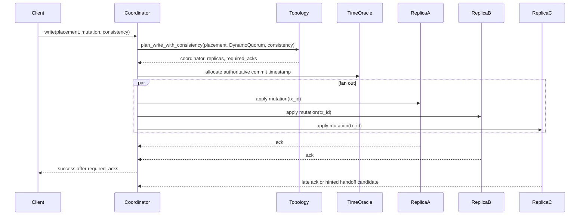
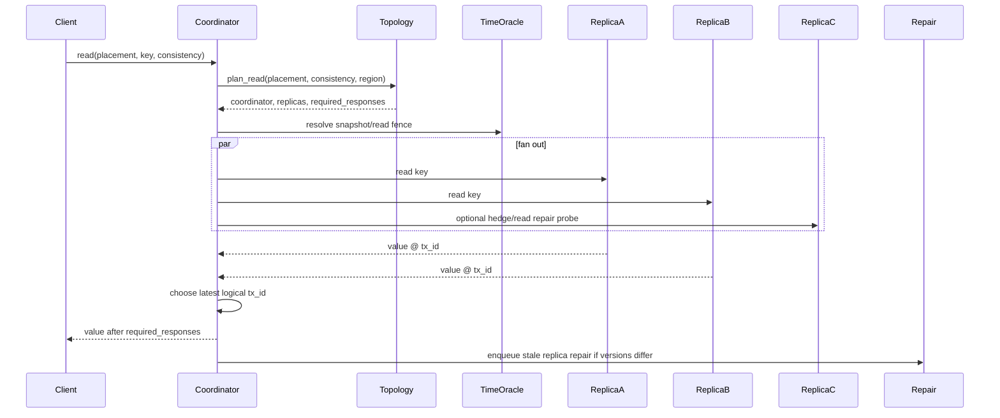
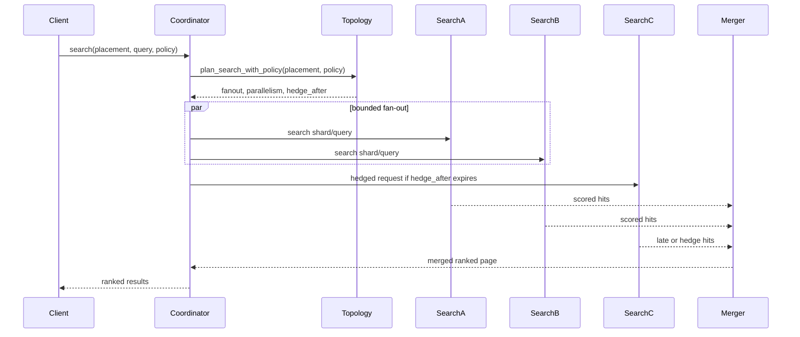

# Distributed Execution Architecture

Date: 2026-05-26

This document is the implementation contract for copperDB distributed writes, reads, and search. The replication target remains Cassandra-like distributed coordination rather than a single Raft leader path. For distributed MVCC snapshot isolation and read-your-own-writes guarantees, copperDB now targets a hybrid model: keep Dynamo-style quorum replication for data durability and fan-out, but allocate authoritative distributed transaction times through a separate consensus-backed transaction-time oracle. Paxos v2 is the intended direction for that oracle layer; it is not a plan to replace the Dynamo quorum replication contract itself. Any Raft-style machinery that remains in the Rust workspace is transitional until it is either adapted behind this contract or removed.

This document defines one replicated placement at a time. The higher-level federated multi-shard AI fabric plan is defined in [federated-ai-fabric-architecture.md](federated-ai-fabric-architecture.md).

## Goals

- Any healthy coordinator-capable node can accept a client write, read, or search request.
- Placement is resolved through `copperdb-topology` using `PlacementKey { tenant, database, shard }`.
- Writes are sent to all healthy storage replicas for the placement and succeed once the requested consistency level is met.
- Reads are sent to enough healthy storage replicas to satisfy the requested consistency level and leave room for read repair.
- Search is planned separately from graph storage reads: search fan-out targets search-capable nodes, merges shard results, and uses hedged requests for p99 control.
- Distributed transaction times for cross-node MVCC snapshot isolation and RYOW come from a consensus-backed transaction-time oracle; topology logical clocks remain the default local allocator and merge helper for non-consensus paths and transitional consumers.
- Session bookmarks and read fences must be expressible as authoritative transaction-time lower bounds so later reads can demand "at least my last committed write" visibility.
- High availability and hyperscaler/distributed transport seams are foundational, but external multi-region transports can remain pluggable while local/in-memory contract tests prove the behavior.

## Core Vocabulary

- `TopologyRegistry`: validated registry of peers, placements, health, search policy inputs, and write/read plan inputs.
- `MeshPeer`: node identity, address, region/zone, capabilities, health, observed latency, load, and capacity.
- `PlacementRecord`: tenant/database/shard ownership, replica nodes, search nodes, and minimum durability requirements.
- `ConsistencyLevel`: `One`, `Quorum`, `All`, and `LocalQuorum`.
- `DistributedWriteMode::DynamoQuorum`: coordinator-based multi-replica writes with Cassandra/Dynamo-style acknowledgement rules.
- `TransactionTimeOracle`: allocates authoritative begin, commit, and read-fence timestamps for distributed SI/RYOW. The local `DistributedTransactionClock` is the default implementation today; the target distributed implementation is Paxos v2-backed.
- `DistributedWritePlan`: coordinator, target replicas, consistency level, and required acknowledgements.
- `DistributedReadPlan`: coordinator, target replicas, consistency level, and required responses.
- `DistributedSearchPlan`: latency-ranked search fan-out, bounded parallelism, and hedge deadline.

## Distributed Write Flow

Write execution rules:

- The coordinator is selected by topology from healthy coordinator-capable placement participants, preferring request locality and lower observed RTT.
- The coordinator does not need to be the primary node.
- For distributed SI/RYOW write paths, the timestamp persisted with the mutation must come from the transaction-time oracle rather than a purely local clock.
- The coordinator fans the mutation to every healthy storage/write participant in the placement.
- `One` requires one successful replica acknowledgement.
- `Quorum` requires `floor(replica_count / 2) + 1` acknowledgements.
- `All` requires every healthy planned replica acknowledgement.
- `LocalQuorum` requires `floor(local_replica_count / 2) + 1` acknowledgements in the request region.
- A write that cannot satisfy the required acknowledgement count fails with `NoQuorum` and must not be reported as committed.
- A distributed write that cannot obtain an authoritative transaction time from the oracle must also fail; quorum success alone is insufficient for the SI/RYOW path.
- Late replica responses may still be accepted as durability progress, but they cannot change a client-visible failure into success after the coordinator has returned.
- Future remote transports should preserve the same plan and acknowledgement contract; only the transport implementation should change.

## Distributed Read Flow

Read execution rules:

- Reads use storage-capable placement participants, sorted by locality, observed RTT, and node id for deterministic planning.
- When the client carries a bookmark or RYOW fence, the coordinator must resolve or validate a snapshot that is at least that fence before treating the read as successful.
- The coordinator waits for enough successful responses to meet the requested consistency level.
- When multiple values are returned, the value with the highest topology logical transaction ID wins.
- Missing, stale, or older-version responses should enqueue read repair once versioned storage values are wired through the engine.
- A read can return `None` only after the requested consistency level has responded and no newer value is found.
- Degraded peers may serve reads when topology policy allows it; unreachable peers do not count toward consistency.

## Distributed Search Flow

Search execution rules:

- Search planning is independent from write/read replica planning because search nodes may be specialized index nodes.
- Search fan-out is bounded by placement `search_fanout` and request policy `max_fanout`.
- Topology ranks candidates by observed RTT plus cross-region penalty plus load divided by capacity weight.
- Same-region search nodes are preferred when `request_region` is known and policy requests locality.
- Hedged requests are issued after the plan hedge deadline to reduce p99 latency.
- Result merging must be deterministic for equal scores, using stable document ids as tie breakers.
- Vector offload through `qdrantgrpc` and internal remote execution through `nornicgrpc` must consume the same `DistributedSearchPlan` rather than inventing separate routing rules.

## Package Responsibilities

- `topology`: owns all placement, peer, consistency, read/write/search planning, and transaction-time vocabulary, including the transaction-time oracle seam and the local logical clock fallback implementation.
- `storage`: persists topology metadata and graph/index records with version information needed for read repair and last-write-wins conflict resolution.
- `replication`: owns coordinator write/read execution, replica transport abstraction, acknowledgement counting, quorum failure behavior, failed-replica outputs, and durable hinted handoff/read-repair queue records.
- `search`: owns local index execution, distributed search routing over `DistributedSearchPlan`, fan-out transport seams, failure tracking, and deterministic result merging.
- `fabric`: exposes placement-aware routing and control-plane-friendly topology views without implementing storage semantics.
- `txsession`: acquires begin and commit timestamps through the transaction-time oracle seam and owns session bookmark/read-fence propagation for RYOW consumers.
- `qdrantgrpc`: executes vector-search subplans against external vector stores when a search plan targets remote vector infrastructure; request envelopes must be derived from `DistributedSearchPlan`.
- `nornicgrpc`: executes internal remote read/write/search RPCs while preserving topology plans and consistency contracts; request envelopes must be derived from `DistributedWritePlan`, `DistributedReadPlan`, or `DistributedSearchPlan`.
- `engine`: loads durable topology from storage, exposes distributed read/write planning, builds Cassandra coordinators with durable repair queues, replays repair batches through replica transports, builds scheduled repair workers, composes the transaction-time oracle for SI/RYOW paths, and routes Cypher through an explicit distributed execution API; protocol crates must not reimplement distributed semantics.
- `server`: selects the distributed Cypher path for HTTP and Neo4j transaction requests when `COPPERDB_DISTRIBUTED_CYPHER` or `x-copperdb-distributed` is enabled, then delegates to the engine API with topology-derived placement and consistency. The server-owned write path now builds a real outbound tonic replica transport from topology peers and generates a short-lived admin cluster JWT when security is enabled. The read path now builds the real graph-read tonic transport, forwarding the original caller bearer token so the receiving node reapplies the existing per-database read gate while clustered access-metadata side effects continue through the internal admin-authenticated replica channel rather than fabricating in-memory replicas.
- `nornicgrpc`: provides generated tonic/prost replica service bindings, remote execution envelopes, a generated-client adapter, a generated-server adapter, and a replica transport adapter that turns replication writes/reads into target-addressed remote client requests.
- `qdrantgrpc`: turns distributed search plans into vector-search requests and provides a production Qdrant HTTP search client plus a distributed executor that fans out to Qdrant targets, records target failures, and merges hits deterministically.

## Failure And Recovery Semantics

- Coordinator failure before client response is retried by the client or upper engine layer using idempotent mutation identity.
- Replica failure before required acknowledgements returns `NoQuorum`.
- Replica failure after required acknowledgements becomes asynchronous repair/hinted handoff work persisted in the replication repair queue.
- Transaction-time oracle unavailability blocks distributed SI/RYOW commits and fenced reads even if enough replicas are otherwise reachable.
- Peer health changes must flow through topology and alter future plans without changing the consistency contract.
- Cross-region failures should prefer local quorum when requested and avoid global stalls for locality-scoped operations.
- Transaction ordering must compare the authoritative transaction times attached to committed values. The local topology logical transaction ID format `(epoch, counter, node_ordinal)` remains the default/fallback allocator and merge helper until the consensus-backed oracle is fully threaded through the distributed write and read-fence paths.

## Implementation Order

1. Keep topology consistency-level read/write plans and tests as the replication baseline.
2. Finish replication coordinator writes and reads using an in-memory replica transport, storage-backed adapter tests, and durable post-quorum repair records.
3. Introduce the transaction-time oracle seam across `topology`, `txsession`, and `engine`, keeping the local logical clock as the default implementation.
4. Add the Paxos v2-backed transaction-time oracle for distributed SI/RYOW begin, commit, and read-fence allocation.
5. Update `fabric` and read paths to propagate bookmarks/read fences so a client can require visibility at or above its last committed transaction time.
6. Keep `search`, `nornicgrpc`, and `qdrantgrpc` aligned with the same plan and fence vocabulary.

Current status: complete for the Layer 3 foundation. Remaining future work belongs to protocol hardening and deeper engine integration, not to the foundational distributed execution contracts.

## Completion Bar

Layer 3 packages can only be checked when:

- The package follows this document as the single distributed execution path.
- Package-owned state is durable or explicitly runtime-only.
- Immediate consumers compile against the package contract.
- Focused tests prove success, quorum failure, topology health behavior, restart/persistence behavior where applicable, and fenced read/write behavior once the transaction-time oracle path is enabled.