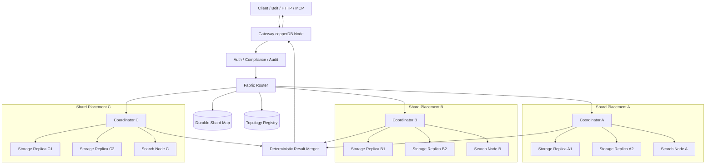
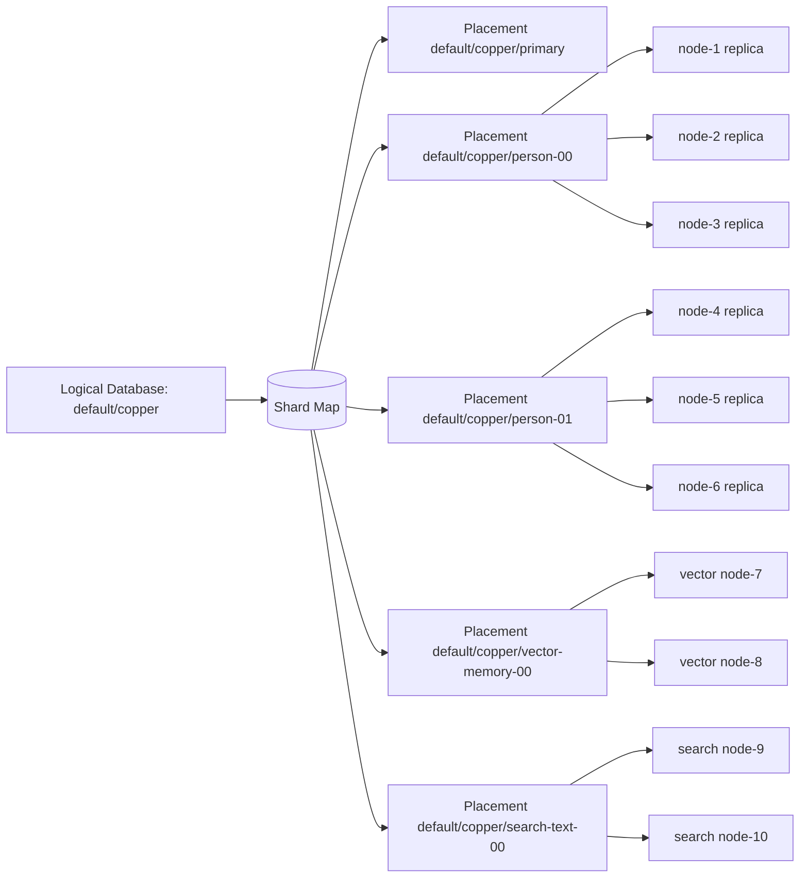
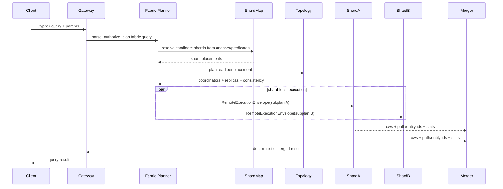
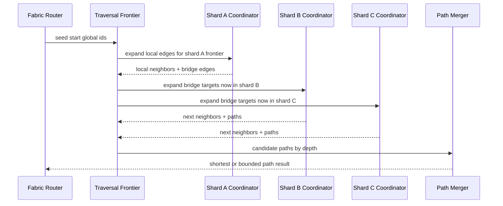
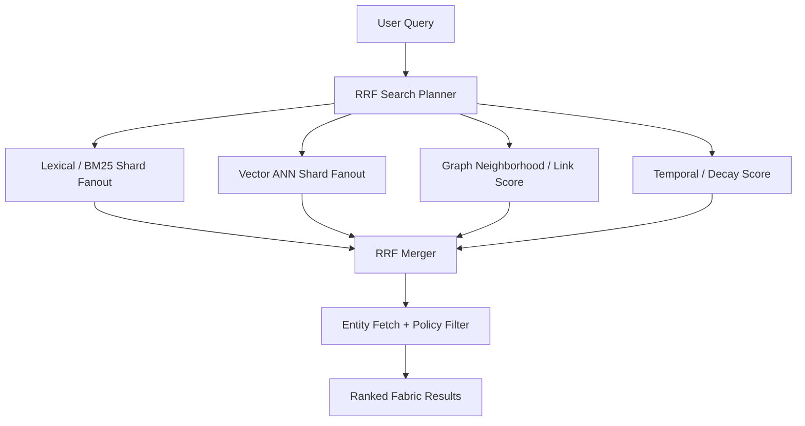
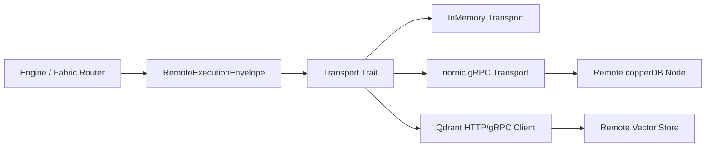

# Federated AI Fabric Architecture

> Deferred design reference. Current implementation priority and the gate for resuming fabric work are defined in [../../COPPERDB_NORNICDB_PARITY_PLAN.md](../../COPPERDB_NORNICDB_PARITY_PLAN.md).

Date: 2026-05-27

Status: deferred roadmap only.

copperDB currently guarantees single-node execution only. This document records a future fabric architecture and should not be read as a shipped or supported runtime surface.

This document defines the future plan above a possible Cassandra-style placement layer. If distributed work resumes later, this plan defines how one logical copperDB database could become an AI fabric mesh spread across many physical machines and many shard placements while preserving a single query path for Cypher, vector, keyword, graph traversal, RRF search, and future agent/memory workloads.

## Architecture Target

copperDB may eventually have two distinct distributed layers:

- Placement replication: Cassandra/Dynamo-style read/write replica sets for one `PlacementKey { tenant, database, shard }`.
- Fabric federation: a query and search router that maps one logical database to many placements, executes shard-local subplans on the correct physical server nodes, and merges results with deterministic semantics.

Historical prototypes and parity scaffolding may exist, but copperDB does not currently support either layer as a product/runtime guarantee. This plan defines the second layer for future work.

## Core Vocabulary

- `FabricDatabase`: logical database exposed to clients. It may contain one or many shards.
- `ShardPlacement`: one shard in a fabric database, identified by `PlacementKey { tenant, database, shard }`.
- `ShardMap`: durable catalog that maps graph partitions, vector collections, full-text partitions, and tenant/database routing rules to shard placements.
- `FabricRouter`: engine-level coordinator that turns a logical query into shard subplans.
- `ShardQueryPlan`: one executable subplan for one shard placement.
- `FabricQueryPlan`: ordered collection of shard subplans plus merge operators.
- `RemoteExecutionEnvelope`: transport-neutral request sent to a remote copperDB node for a shard-local query, traversal, write, or search.
- `ResultMerger`: deterministic merge operator for rows, paths, graph entities, vector hits, keyword hits, and RRF-ranked search results.
- `BridgeEdge`: edge whose start and end nodes live on different shard placements.
- `ShardLocalId`: stable entity id scoped to a shard.
- `FabricGlobalId`: stable entity id that includes shard identity and local id.

## System Diagram



## Data Distribution Model

Data distribution is explicit and cataloged. The fabric layer must not infer ownership from incidental storage layout.

Shard ownership rules:

- Every graph entity belongs to exactly one home shard.
- Node home shard is assigned by a durable partitioning policy.
- Edge home shard defaults to the start-node shard unless a policy assigns relationship types to dedicated edge shards.
- Cross-shard edges are stored as bridge-edge records with global ids for both endpoints.
- Vector embeddings and full-text documents inherit the home shard of their source entity unless a collection-specific policy overrides it.
- Every shard placement is independently replicated by the existing Cassandra-style placement layer.

Required partitioning policies:

- Tenant/database default shard for small deployments.
- Hash partition by stable entity key.
- Label/type-aware partitioning for high-cardinality graph domains.
- Vector collection partitioning by collection and hash bucket.
- Temporal partitioning for event/memory streams.
- Manual pinned placements for regulated, regional, or hot data.

Global id format:

```text
fabric://{tenant}/{database}/{shard}/{entity-kind}/{local-id}
```

This lets query execution distinguish an entity node in the graph from the server node that owns its shard. Server-node routing always uses placement metadata; graph entity ids only help choose a shard when the query includes a shardable anchor.

## Placement And Shard Map



The current `PlacementKey::default_for_database(database)` maps to shard `primary`. The fabric router must generalize this into a shard-map lookup that returns one placement for targeted queries or many placements for scatter/gather queries.

## Distributed Query Flow



Query planning rules:

- If an anchored node id, global id, tenant partition, or indexed property maps to one shard, route to that shard only.
- If a query has no shardable anchor, scatter to all eligible shards in the logical database subject to policy limits.
- Push filters, projections, limits, and index lookups down to shard-local subplans whenever semantics allow it.
- Keep final ordering, distinct, aggregation, pagination, and RRF merging in the fabric merger unless proven shard-local.
- Preserve the current routed distributed path-query shapes as shard-local subplans; do not fork a separate distributed Cypher executor.

## Distributed Traversal Flow



Traversal requirements:

- BFS/variable-length traversal is frontier-based across shards.
- The frontier is grouped by shard placement before each expansion round.
- Each expansion round uses the existing placement read plan for that shard.
- Cross-shard bridge edges enqueue the remote endpoint into the destination shard frontier.
- Visited state is keyed by `(global_node_id, depth)` for local parity with current BFS semantics.
- Shortest-path queries stop only after all frontier expansions at the winning depth have completed across relevant shards.
- Traversal results materialize full path objects by fetching node/edge records from their home shards.

## Distributed RRF Search

RRF search combines lexical, vector, graph, and recency/rerank signals across shards.



RRF requirements:

- Each retrieval family returns `(global_id, rank, score, source, shard)`.
- The fabric merger computes reciprocal rank fusion with stable tie-breaking by global id.
- Search fanout uses `DistributedSearchPlan` for search-capable nodes, not storage replicas unless a shard has no separate search nodes.
- Vector offload through Qdrant and local vector search both produce the same hit envelope.
- Graph expansion used for search enrichment must use the distributed traversal frontier, not local-only graph scans.
- Policy filtering and compliance redaction happen after candidate merge and before final entity hydration.

## Communication Mechanism

Inter-node communication must use transport-neutral envelopes and pluggable transports.

Current transport pieces:

- `ReplicaTransport`: in-process abstraction used by replication and graph-read tests.
- `InMemoryReplicaTransport`: deterministic local test transport.
- `StorageEngineAdapter`: storage-backed replica adapter.
- `nornicgrpc`: generated gRPC service/client adapter intended for real node-to-node RPC.
- `qdrantgrpc`: external vector-store search transport.

Target communication layers:



Envelope types:

- `ShardRead`: shard-local Cypher/read/query subplan.
- `ShardWrite`: mutation command with logical transaction id and idempotency key.
- `ShardTraversalExpand`: frontier expansion request for one shard and depth.
- `ShardSearch`: lexical/vector/search request for one shard or search node set.
- `ShardFetch`: hydrate global ids from their home shards.
- `Repair`: hinted handoff or read-repair replay.

Transport requirements:

- Every envelope carries `placement`, `coordinator`, `consistency`, `request_region`, auth/compliance context, query id, deadline, idempotency key, and trace context.
- Every envelope must also align with [request-cancellation-propagation.md](request-cancellation-propagation.md): carry request id, parent lineage, narrowed deadline, and cancellation identity so HTTP/Bolt/gRPC ingress cancellation fans out across shard reads, writes, traversal expansion, ranked search, hydration, and hedged requests.
- The router never sends directly to arbitrary server nodes; it sends to nodes selected by topology plans for the target placement.
- Remote nodes validate that they are eligible participants for the requested placement before executing.
- Results include responding node id, failed replicas, logical transaction watermark, partial result flag, and repair hints.
- gRPC is the production copperDB-to-copperDB protocol; in-memory transport remains the deterministic test mechanism.

## Write Model Across Shards

Single-shard writes:

- Use existing Dynamo quorum placement writes.
- Coordinator fans out to healthy replicas for that shard placement.
- Success is based on requested consistency level.

Multi-shard writes:

- Must be planned as a fabric transaction with one sub-write per shard placement.
- The first implementation should require explicit idempotency keys and write fences rather than pretending to have global ACID.
- Cross-shard edge creation writes the edge home shard plus bridge metadata for endpoint shards.
- Failure after partial success records durable repair/compensation work.
- Later versions may add a saga coordinator or per-shard prepare/commit protocol, but the default graph workload should prefer idempotent, repairable operations.

## Read Consistency Across Shards

The fabric layer composes per-shard consistency; it does not create a single magic global quorum.

- `One`: each touched shard may satisfy its local read with one replica response.
- `Quorum`: each touched shard must satisfy local quorum.
- `All`: each touched shard must satisfy all planned local replicas.
- `LocalQuorum`: each touched shard must satisfy local-region quorum.

For cross-shard queries, results should include a fabric read watermark: the minimum logical transaction id observed across all touched shard plans. That watermark can support future repeatable-read snapshots.

## Missing Pieces To Implement

The complete AI fabric mesh needs these packages or modules beyond the current foundation:

- Durable shard-map catalog in `storage` or `multidb`.
- `fabric` query planner that maps logical queries to shard subplans.
- Global id encoding/decoding helpers shared by `cypher`, `eval`, `engine`, `search`, and `storage`.
- Remote shard execution envelope in `nornicgrpc` for reads, writes, traversal expansion, search, and hydration.
- Shard-local query execution mode in `engine` that can run a bounded subplan without re-routing recursively.
- Cross-shard traversal frontier executor.
- RRF search executor fanout over lexical, vector, graph, and temporal candidates.
- Entity hydration service that fetches merged global ids from their home shards.
- Full server-side ranked search entry points that are exposed beyond the current embedded engine facade.
- Control-plane APIs for shard creation, rebalancing, placement movement, and topology health.
- Repair/rebalance workers for shard movement and cross-shard bridge consistency.

## Implementation Phases

1. Shard-map contract: define durable `FabricDatabase`, `ShardPlacement`, partition policy, and global id types.
2. Fabric read planner: targeted one-shard routing, scatter/gather all-shard routing, deterministic row merge, and tests over in-memory transports.
3. Shard-local Cypher subplans: execute existing routed path-query slices as subplans against one placement without local fallback surprises.
4. Cross-shard traversal: frontier grouping by shard, bridge-edge expansion, shortest-path depth barrier, and path hydration.
5. Distributed RRF search: lexical/vector/graph fanout, reciprocal-rank merge, policy filtering, and hydration.
6. Multi-shard writes: idempotent sub-writes, bridge-edge writes, repair records, and failure-mode tests.
7. Production communication: gRPC remote envelopes for every shard operation, request cancellation propagation, deadline propagation, auth context, trace context, and participant validation.
8. Rebalancing: shard split/move/copy, dual-write or catch-up, cutover, and cleanup.

Current implementation status:

- Phase 1 foundation is started in code. `copperdb-topology` now owns `FabricDatabase`, `FabricShard`, `FabricPartitionPolicy`, `FabricShardKind`, and `FabricGlobalId` contracts.
- `copperdb-storage` persists and lists durable fabric database shard maps through storage metadata.
- `copperdb-fabric` can plan read and search subplans for every shard placement in a logical fabric database by reusing the existing topology placement planners.
- `copperdb-engine` exposes the first embedded control-plane facade for registering, listing, loading, and planning fabric databases from durable storage plus topology metadata.
- `copperdb-search` has the deterministic RRF merge primitive, ranked batch outcome contract, planned-shard batch collector, planned-shard composition helper, transport-backed home-shard hydration collection, and post-merge policy/hydration helper for fabric hits keyed by global ids, with touched-shard tracking, responded/failed node reporting, planned/responded/missing shard accounting, source aggregation, compliance-style redaction, and stable tie-breaking across shard placements; `copperdb-engine` exposes them through the embedded facade, including an async full transport-backed ranked search execution entry point that plans hydration reads from hit home shards, and `copperdb-nornicgrpc` now provides the concrete ranked-search and hydration gRPC request/response messages plus tonic client/server adapters for those calls.
- `copperdb-fabric` has the first read-planning contract for targeted and scatter/gather scopes: all shards, default shard, shard name, label, relationship type, collection, and global id.
- `copperdb-fabric` has the first deterministic row, aggregate, and path-set merge operators for scatter/gather reads and traversals, including stable shard-order merge, distinct, ordering, skip, limit, grouped count, distinct count, sum, average, min, max, path deduplication by fabric global ids, shortest-first ordering, and cost tie-breaks; `copperdb-engine` exposes them through the embedded facade.
- `copperdb-server` exposes thin authenticated HTTP admin routes to register, list, and inspect read/search plans for fabric database shard maps through the engine facade; plan inspection accepts scope, value, consistency, and region query parameters, and `POST /admin/fabric/databases/{tenant}/{database}/ranked-search` now executes transport-backed ranked fabric search plus home-shard hydration over the gRPC ranked-search and hydration RPCs.
- The remaining Phase 1 gap is update/rebalance semantics for existing fabric database shard maps; creation, plan inspection, and ranked search execution are now exposed.

## Completion Bar

This architecture is complete only when:

- A logical database can declare multiple shard placements and route queries through the shard map.
- Distributed Cypher reads can target one shard or scatter/gather multiple shards with deterministic merges.
- Distributed traversals can cross physical server nodes and shard placements through bridge edges.
- RRF search can merge lexical, vector, graph, and temporal candidates across shard placements.
- Writes use the existing Cassandra-style replica set per touched shard and have explicit multi-shard failure semantics.
- Remote copperDB-to-copperDB communication uses production gRPC envelopes with the same behavior as in-memory tests.
- Protocol handlers remain thin and call the engine/fabric API rather than implementing distributed logic themselves.